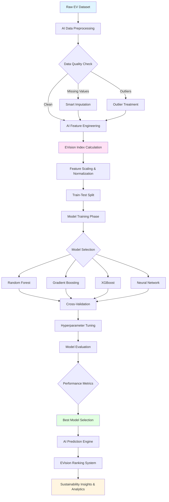
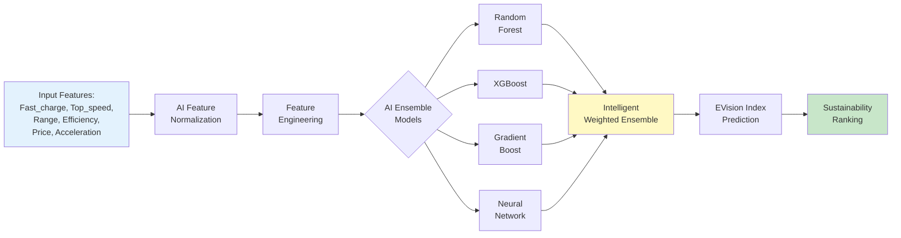

# 🌿⚡ EVision: AI-Powered Sustainability and Innovation Index for Electric Vehicles

Transforming EV data into actionable sustainability and innovation intelligence

[Key Features](#-features) • [Architecture](#-project-architecture) • [Methodology](#-innovation-score-methodology) • [Roadmap](#-roadmap)

---

## 📋 Table of Contents

- [Overview](#overview)
- [Innovation Score Methodology](#innovation-score-methodology)
- [Project Architecture](#project-architecture)
- [Features](#features)
- [Dataset Requirements](#dataset-requirements)
- [Planned Implementation](#planned-implementation)
- [Industry Applications](#industry-applications)
- [Roadmap](#roadmap)

---

## 🎯 Overview

*EVision* is an AI-powered platform that aims to develop a comprehensive sustainability and innovation index for electric vehicles. By leveraging machine learning and multi-dimensional analysis, EVision evaluates and ranks EVs based on technological advancement, energy efficiency, and consumer value. This intelligent system will provide actionable insights for:

- *Automotive Manufacturers* - R&D prioritization and competitive analysis
- *Marketing Teams* - Product positioning and market segmentation
- *Industry Analysts* - Benchmarking and trend identification
- *Consumers* - Informed purchasing decisions

### Key Objectives

1. *Sustainability Quantification*: Transform environmental impact into measurable innovation metrics
2. *Multi-Factor AI Analysis*: Balance performance, efficiency, and affordability using ML
3. *Predictive Intelligence*: Forecast innovation scores for emerging EV models
4. *Competitive Benchmarking*: Compare brands (Tesla, BYD, MG, etc.) with AI-driven insights
5. *Future-Ready Scoring*: Adapt to evolving EV technology and sustainability standards

---

## 🧮 Sustainability & Innovation Index Methodology

The *EVision Index* is a composite metric derived from three core pillars that balance sustainability with innovation:

### 1. Technological Edge (35% weight)
- *Fast Charging Capability* (Fast_charge) - Charging speed in km/h
- *Top Speed* (Top_speed) - Maximum velocity in km/h
- *Acceleration* (acceleration..0.100.) - 0-100 km/h time (inverse scoring - lower is better)

### 2. Energy Intelligence (35% weight)
- *Efficiency* (Efficiency) - Wh/km consumption (lower is better)
- *Range* (Range) - Maximum distance on single charge
- *Battery Optimization* - Energy-to-range ratio

### 3. User Value (30% weight)
- *Price Point* (Price.DE.) - Vehicle cost in EUR
- *Value Proposition* - Performance-to-price ratio
- *Cost Efficiency* - Range per unit cost

### Scoring Formula

EVision Index = (0.35 × Tech_Score) + (0.35 × Energy_Score) + (0.30 × Value_Score)

Where:
- Tech_Score = Normalized(Fast_charge + Top_speed - acceleration_penalty)
- Energy_Score = Normalized(Range + efficiency_benefit) [Sustainability Focus]
- Value_Score = Normalized(performance_metrics / Price.DE.)

All scores normalized to 0-100 scale via AI-driven normalization

---

## 🏗 Project Architecture

---

## ✨ Features

### Planned Core Capabilities

- *🤖 AI-Powered Feature Engineering*: Create 15+ derived features from base attributes
  - Performance-to-price ratio
  - Energy efficiency index (sustainability metric)
  - Charging speed factor
  - Range-to-cost ratio
  - Carbon footprint estimation

- *🧠 Multi-Model AI Ensemble*: Combine predictions from multiple algorithms
  - Random Forest Regressor
  - XGBoost
  - Gradient Boosting
  - Neural Networks

- *📊 Automated EDA with AI*: Comprehensive exploratory data analysis
  - Distribution analysis
  - Correlation matrices
  - Outlier detection with ML
  - Missing data patterns
  - Sustainability trend identification

- *⚙ Intelligent Hyperparameter Optimization*: Grid/Random search with cross-validation

- *📈 Real-time AI Scoring*: Instant EVision index calculation for new vehicles

- *🎨 Interactive Visualizations*: Dynamic plots and sustainability dashboards
  - EVision index distributions
  - Brand sustainability comparison charts
  - Feature importance plots
  - Innovation vs sustainability scatter plots
  - Trend analysis over time

---

## 📁 Dataset Requirements

### Required Features

| Feature | Description | Unit | Example |
|---------|-------------|------|---------|
| Fast_charge | Fast charging speed | km/h | 850 |
| Top_speed | Maximum speed | km/h | 210 |
| Range | Maximum range | km | 520 |
| Efficiency | Energy consumption | Wh/km | 175 |
| Price.DE. | Price in Germany | EUR | 45000 |
| acceleration..0.100. | 0-100 km/h time | seconds | 4.2 |

### Optional Features
- Brand name
- Model name
- Battery capacity
- Release year
- Vehicle segment

### Data Format
- CSV or Excel format
- Minimum 100 records recommended
- No strict maximum limit

---

## 🛠 Planned Implementation

### Phase 1: Data Preparation
python
# Pseudocode structure
1. Load EV dataset
2. Handle missing values (mean/median imputation)
3. Detect and treat outliers (IQR method)
4. Normalize features (StandardScaler/MinMaxScaler)

### Phase 2: Feature Engineering
python
# Create derived features
- performance_index = (Top_speed + Fast_charge) / acceleration
- efficiency_score = Range / Efficiency
- value_ratio = (Range * Fast_charge) / Price.DE.
- tech_score = weighted combination of tech features
- energy_score = weighted combination of efficiency features
- value_score = weighted combination of price features

### Phase 3: EVision Index Calculation
python
# Target variable creation
evision_index = (0.35 * tech_score_normalized + 
                 0.35 * energy_score_normalized + 
                 0.30 * value_score_normalized) * 100

### Phase 4: AI Model Development
python
# AI model training pipeline
1. Split data (80% train, 20% test)
2. Train multiple regression models with AI
3. Perform cross-validation (5-fold)
4. Intelligent hyperparameter tuning
5. Select best performing AI model
6. Evaluate on test set with sustainability metrics

### Phase 5: Prediction & EVision Ranking
python
# EVision ranking system
1. Predict EVision index for all vehicles
2. Rank vehicles by sustainability & innovation score
3. Generate AI-powered insights and comparisons
4. Create interactive visualization dashboard
5. Export sustainability reports

---

## 🔄 EVision AI Pipeline Overview

---

## 💼 Industry Applications

### 1. R&D Strategy
- *Innovation Gap Analysis*: Identify sustainability and innovation gaps in current lineup
- *Development Prioritization*: Focus resources on high-impact sustainable innovation areas
- *Competitive Intelligence*: Track competitor sustainability and innovation trajectories
- *Future-Ready Planning*: Align R&D with emerging EV standards

### 2. Marketing Positioning
- *AI-Driven Segmentation*: Position vehicles based on objective sustainability and innovation metrics
- *Strength Highlighting*: Emphasize EVision advantages in marketing materials
- *Campaign Targeting*: Reach eco-conscious audiences seeking innovation
- *Brand Storytelling*: Leverage EVision scores for sustainability narratives

### 3. Investment Analysis
- *Brand Evaluation*: Assess manufacturer sustainability and innovation capabilities
- *Market Leader Identification*: Spot emerging and established green leaders
- *Trend Forecasting*: Predict future sustainability and innovation directions
- *ESG Scoring*: Support environmental, social, and governance investment decisions

### 4. Consumer Guidance
- *Transparent Comparison*: Provide objective sustainability and innovation comparisons
- *Value Assessment*: Help buyers understand eco-value-for-money
- *Purchase Decisions*: Support informed buying with AI-backed sustainability insights
- *Long-term Impact*: Calculate total cost of ownership with sustainability factors

---

## 🗺 Roadmap

### Short-term Goals (Months 1-2)
- [ ] Dataset collection and cleaning (EV specifications)
- [ ] Exploratory data analysis with AI tools
- [ ] Advanced feature engineering implementation
- [ ] EVision index formula development
- [ ] Sustainability metrics integration
- [ ] Basic visualization creation

### Medium-term Goals (Months 3-4)
- [ ] AI model training and evaluation
- [ ] Intelligent hyperparameter optimization
- [ ] Model comparison and ensemble selection
- [ ] AI prediction pipeline development
- [ ] EVision ranking system implementation
- [ ] Sustainability insights generation

### Long-term Goals (Months 5-6)
- [ ] Interactive AI dashboard creation
- [ ] RESTful API development for real-time scoring
- [ ] Comprehensive documentation and user guides
- [ ] Testing with real-world EV data
- [ ] Production deployment preparation
- [ ] Mobile app prototype (optional)

---

## 🔮 Future Enhancements

### Technical Improvements
- Real-time data integration from EV manufacturer APIs
- Deep learning architectures (LSTM for time-series predictions)
- AutoML for automated AI model selection
- Explainable AI with SHAP values and LIME
- Transfer learning for new vehicle segments

### Feature Additions
- *Sustainability Focus*: Carbon footprint calculations, lifecycle analysis
- Sentiment analysis from user reviews and social media
- Regional EVision scoring adaptations (EU, US, Asia standards)
- Historical innovation and sustainability tracking over time
- Predictive maintenance factors
- Charging infrastructure availability scoring
- Government incentive integration

### Deployment Options
- Web application with interactive AI dashboard
- Mobile app for on-the-go EVision comparisons
- RESTful API for third-party integrations
- Automated sustainability reporting system
- Chatbot for EV recommendations
- Browser extension for real-time scoring

---

